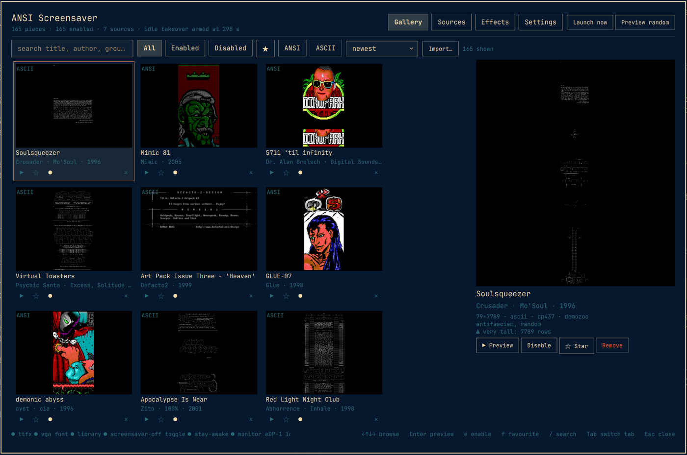
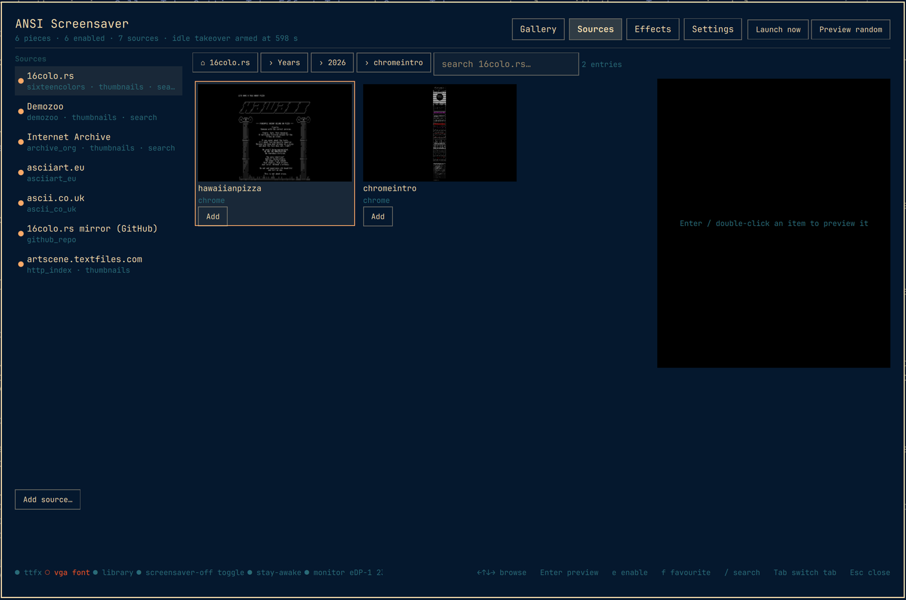
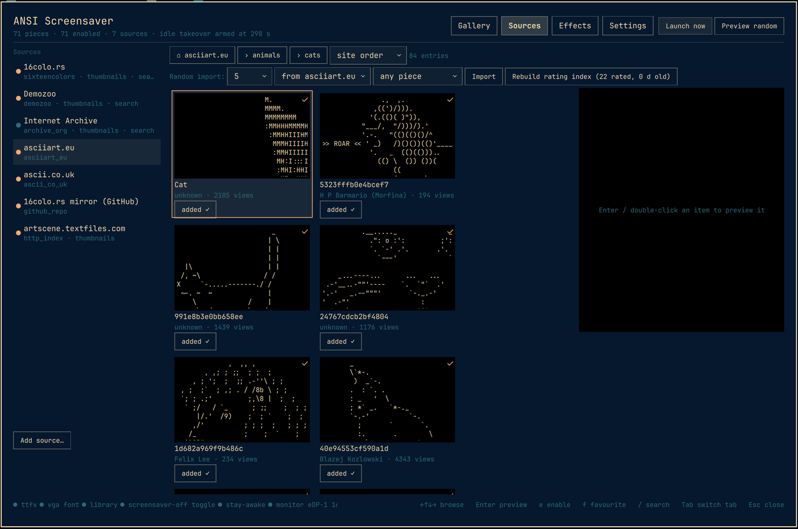
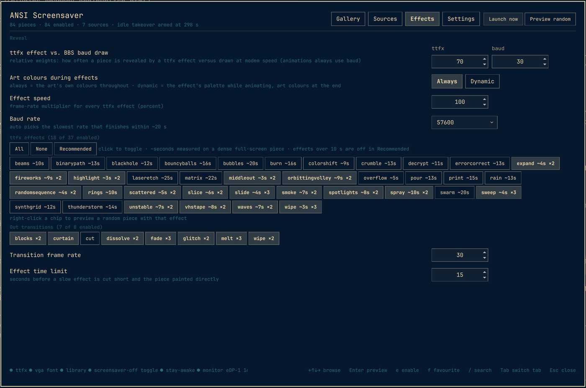
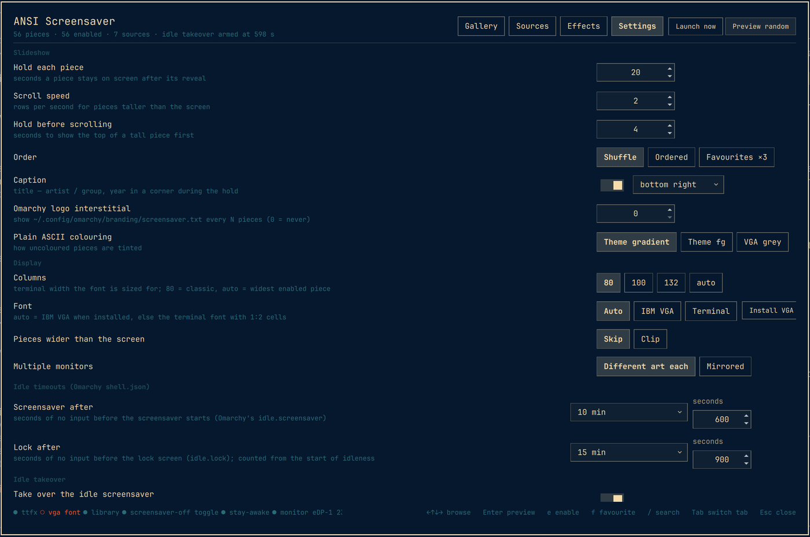
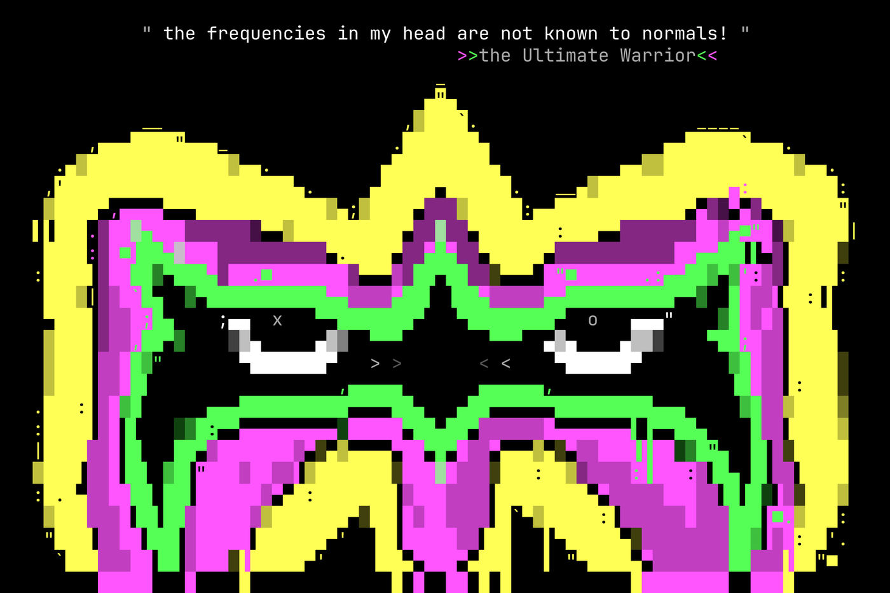
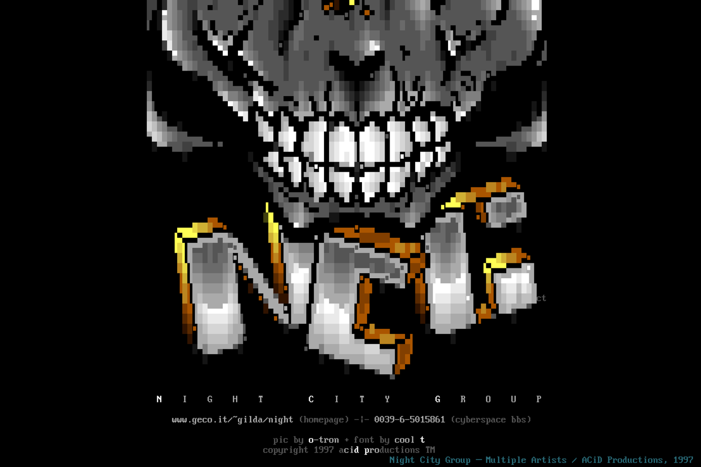

# ANSI Screensaver for Omarchy

A screensaver that turns Omarchy's `ttfx` terminal animations into a slideshow of
classic and modern **ANSI/ASCII scene art** — with a gallery to manage the pieces,
browsers for the public art archives, and a bar icon.

- Every piece is revealed by one of `ttfx`'s 37 effects (18 are on by default —
  the ones that finish within ~10 s; the art keeps its own colours) **or** drawn
  at emulated modem speed the way a BBS would have shown it. Pieces taller than
  the screen keep flowing in line by line (15 rows/s) right after the reveal; a
  credit caption (title / artist / group / year) sits on a free line, never over
  the art; then one of seven out-transitions (fade, dissolve, wipe, Doom-melt,
  curtain, glitch, blocks) clears the screen for the next piece.
- Starts with a curated set of 50 pieces (fetched from 16colo.rs on first run,
  credits in `ATTRIBUTION.md`) and lets you add more from **16colo.rs**, **Demozoo**, the **Internet Archive**, **GitHub
  repositories** (preconfigured: the sixteencolors archive mirror), any **HTTP
  directory index** (preconfigured: artscene.textfiles.com), **asciiart.eu** and
  **ascii.co.uk** — or from local files, folders, zips and URLs.
- Takes over Omarchy's idle screensaver without touching the stock one: the
  moment the stock screensaver window appears, the plugin freezes it, starts
  ours in its place and removes it — lock, wake and stay-awake keep working,
  and a fallback idle timer covers a stock launcher that never ran.

## Screenshots

| | |
|---|---|
|  The library gallery: thumbnails with per-card preview / star / enable / remove, search, filters, sort. |  Browsing a 16colo.rs pack — thumbnails from the archive, Add / Add all. |
|  asciiart.eu with view/like counts, rating sort and the random-import row. |  Effects: reveal mix, the ttfx effect set with measured durations, out-transitions. |
|  Settings: slideshow timing, display/font, Omarchy idle timeouts, takeover. | |

The screensaver itself (art credits in the captions; both pieces are on 16colo.rs):


*"the ultimate warrior" — xeR0 / Blocktronics, 2020, mid-reveal.*


*"Night City Group" — ACiD Productions, 1997, scrolled to the end with the credit caption; IBM VGA font.*

## Requirements

- Omarchy 4.x (Quickshell shell, Hyprland) with its stock `ttfx` and `ghostty` packages.
- Python 3.12+ (standard library only). Optional: `python-pillow` (thumbnails and previews),
  `bsdtar`/libarchive (LHA/ARJ archives from older packs — installed on Omarchy by default).
- No sudo or pkexec is required. Nothing runs as root.

Everything the plugin writes lives in `~/.config/omarchy/ansi-screensaver/`,
`~/.cache/ansi-screensaver/`, `~/.local/state/ansi-screensaver/` and, only when
you ask for it, `~/.local/bin/ansi-screensaver` (symlink) and
`~/.local/share/fonts/ansi-screensaver/` (the VGA font). It never edits your
Omarchy configuration except through Omarchy's own commands: enabling the bar
widget (`omarchy plugin enable`) and, if you change them in Settings, the idle
timeouts in `shell.json` via `omarchy-shell-config`.

## Install

```sh
omarchy plugin add https://github.com/theothermike/omarchy-ansi-screensaver.git --enable
```

That is all: the bar icon appears, the starter set is fetched into your library
the first time the gallery or screensaver runs, and idle takeover is armed.
Optional extras, all from inside the plugin:

- **Settings → Install VGA font** installs the vendored IBM VGA 8×16 face for your
  user (authentic glyphs, 1:2 cells). The terminal font is used otherwise.
- `~/.config/omarchy/plugins/io.github.theothermike.ansi-screensaver/bin/ansi-screensaver install`
  symlinks the CLI to `~/.local/bin` if you want to script it. Nothing in the
  plugin needs this.

## Remove

```sh
omarchy plugin remove io.github.theothermike.ansi-screensaver --yes
```

Omarchy's stock screensaver takes over again immediately. Your library, caches
and log are kept in case you reinstall; delete them if you want a clean slate:

```sh
rm -rf ~/.config/omarchy/ansi-screensaver ~/.cache/ansi-screensaver ~/.local/state/ansi-screensaver
rm -f ~/.local/bin/ansi-screensaver; rm -rf ~/.local/share/fonts/ansi-screensaver   # only if you used the extras
```

## Using it

**Bar icon** — left click: gallery · right click: launch now · middle click:
toggle idle takeover. The dot badge shows takeover is armed; the icon dims when
Omarchy's screensaver-off toggle or stay-awake is set.

**Gallery** (`omarchy-shell ansisaver open`) — four tabs:

| Tab | What you do there |
|---|---|
| Gallery | thumbnails of the library with quick actions under each card (▶ preview · ☆ star · ● enable/disable · ✕ remove); double-click previews, right-click toggles enabled; search, filters (enabled/disabled/starred/ANSI/ASCII), sort by newest/title/artist/year/height/rating; hover for a full render; import files/folders/zips/URLs |
| Sources | one tree browser for every art source: open packs/categories, see thumbnails or text previews (**Preview all** renders the rest on demand), **Add** a piece or **Add all** of a pack; **Random import** N pieces from this source or all of them (walks each catalogue at random, never repeats a pick), or the **highest rated** where a source has ratings (asciiart.eu likes/views — build its rating index once); sort by rating; add your own GitHub repos / HTTP indexes |
| Effects | which ttfx effects and out-transitions play — each chip shows its measured duration (`matrix ~22s`), **Recommended** restores the under-10-second set; reveal mix (ttfx vs. baud), colour handling, effect speed, baud rate, the 15 s effect time limit; right-click an effect to preview it |
| Settings | hold time, scroll speed and pause, order, caption, logo interstitial, ASCII colouring; **Gallery: confirm before removing** (off = one click removes); columns, font (+ Install VGA font), wide pieces, multi-monitor; **Omarchy's idle timeouts** (screensaver / lock, preset dropdown or exact seconds — written to `shell.json` through `omarchy-shell-config`); idle takeover (+ a 10 s test); maintenance (doctor, thumbnails, seed, stop) |

Keys: arrows/hjkl browse · Enter preview/open · `e` enable · `f` favourite ·
`Delete` remove · `/` search · Tab / Ctrl+1-4 switch tab · F5 refresh · Esc close.
In Sources also: `a` add · `p` preview all · `n` load more · Backspace up a level.

**Screensaver** — any key or mouse movement ends it (also focus loss and the
lock screen). `omarchy-shell ansisaver launch` (or `ansi-screensaver launch --force`)
starts it now, `stop` ends it, `preview <id>` shows one piece on the focused monitor.

**Configuration** — `~/.config/omarchy/ansi-screensaver/config.json` holds only
the values you changed (`ansi-screensaver config dump` shows the effective set,
`config set key value` changes one). Notable keys (defaults in brackets): `hold_seconds` (20),
`scroll_rows_per_second` (15), `hold_top_seconds` (0), `columns` (80 / 100 /
132 / auto), `font` (auto / vga / terminal), `reveal.ttfx` / `reveal.baud` weights,
`ttfx.effects.<name>` and `transitions.out.<name>` weights (0 = off),
`ttfx.max_seconds` (15), `confirm_remove`, `idle.takeover`, `idle.fallback_seconds`.

## Sources

The Sources tab shows one tree browser for every archive. Pick a source on the
left, open folders/packs, and use **Add** on a piece or **Add all** on a pack.
Items show the archive's thumbnail when it has one, the text itself for pure
ASCII sites, or a **Preview** button; **Preview all** (or `p`) renders every
pictureless item on the page one by one. `a` adds the selected item, `Enter`
opens/previews, `Backspace` goes up, `/` searches where the source supports it.

| Source | What it is | Browse by | Thumbnails | Ratings |
|---|---|---|---|---|
| **16colo.rs** | the ANSI/ASCII art archive: every artpack since 1990 (JSON API) | year → pack, group, artist, latest, search | yes | no |
| **Demozoo** | demoscene database: ANSI / ASCII / ASCII-collection / artpack productions | type, search; files via scene.org | per item | no |
| **Internet Archive** | search-driven: items → files → archive members | preset queries or free search | item image | no |
| **GitHub repositories** | any repo (the sixteencolors archive mirror is preconfigured) | folders → archives → members | via 16colo.rs for the mirror | no |
| **HTTP directory indexes** | plain listings such as artscene.textfiles.com (preconfigured) | folders → files/archives | when the site has `.png` renders | no |
| **asciiart.eu** | the ASCII Art Archive (categories of classic ASCII) | category → subcategory → piece | text preview | **likes + views** |
| **ascii.co.uk** | topic pages of ASCII art | topic → piece | text preview | no |

Add your own GitHub repository or HTTP index with **Add source…** (or
`ansi-screensaver sources add --kind github_repo|http_index --url …`).
Packs in `.zip`, `.lha`/`.lzh` and other archive formats are opened with
libarchive; 16colo.rs pieces are fetched individually so no pack download is needed.

**Random import** — the row above the grid imports *N* random pieces from the
current source or from all of them (each source walks its own catalogue at
random: a random year → pack → file on 16colo.rs, a random page on Demozoo, a
random category on asciiart.eu…). Picks are remembered in
`~/.cache/ansi-screensaver/sources/random-history.json` so you never get the
same piece twice, and imports carry a `random` tag. **Highest rated** works for
sources with ratings — currently asciiart.eu — after you build its rating index
once (**Build rating index**, a few minutes: it records likes/views for every
piece on the site); picks are then sampled from the top tenth by score.

Everything imported keeps its credits: SAUCE title/artist/group/date when the
file has them, the archive's own metadata otherwise, plus the source URL and a
licence note in `meta.json`. The bundled starter set (`catalog.json`) is
fetched from 16colo.rs on first run and listed with full credits in
`ATTRIBUTION.md`; the artwork remains its artists' property.

## CLI

```
ansi-screensaver launch [--force] [--piece ID] [--effect NAME|baud] [--once] [--dry-run]
ansi-screensaver stop [--previews] | preview [ID | --random] [--effect NAME]
ansi-screensaver library list|show|enable|disable|favorite|unfavorite|remove ID
ansi-screensaver import <file|dir|zip|url>... [--encoding cp437|latin1|utf8] [--wrap pending]
ansi-screensaver sources list|add --kind github_repo|http_index --url ...|remove ID
ansi-screensaver browse --source ID [--path SEG]... [--search Q] [--page N] [--details]   # --source omitted lists sources
ansi-screensaver add --source ID --entry EID [--all]     preview --source ID --entry EID
ansi-screensaver random --count N [--source ID | --all] [--top]      index build|status --source ID
ansi-screensaver idle get | set [--screensaver S] [--lock S]        # Omarchy's own timeouts (shell.json)
ansi-screensaver config get|set|dump    doctor [--network]    snapshot    seed    thumbs
ansi-screensaver fonts install|status   install [--fonts] [--seed]
ansi-screensaver fetch [--catalog F] [--into DIR]   curate --packs ...   bundle   attribution   (dev)
```

Add `--json` for machine-readable output and `--progress` to stream
`progress n/total label` lines on long jobs. IPC (`omarchy-shell ansisaver <fn>`):
`open`, `openTab <tab>`, `launch`, `stop`, `preview [id]`, `toggleTakeover`,
`refresh`, `status`, `armTest <seconds>`, `disarmTest`, `set <key> <json>`,
`setIdle screensaver|lock <seconds>`, `library <action> <id>`,
`browse <source> 'seg|seg|seg'` (opens the gallery at that source path).

## Files

| Path | Purpose |
|---|---|
| `~/.config/omarchy/ansi-screensaver/config.json` | settings (`config dump` shows every key) |
| `~/.config/omarchy/ansi-screensaver/library/<id>/` | `original.*`, `meta.json`, `flat.ans` (normalised), `render.png`, `thumb.png` |
| `~/.cache/ansi-screensaver/` | source API responses, downloaded packs, previews, font-size calibration, `sources/random-history.json` (random picks), `sources/asciiart_eu/index.json` (rating index) |
| `~/.local/state/ansi-screensaver/runner.log` | what the slideshow did |
| `catalog.json`, `ATTRIBUTION.md` (repo) | the curated starter set (fetched on first run) and its credits |

## How it works

`.ans` files are full of cursor movement, iCE colours and CP437 bytes that `ttfx`
cannot take, so the engine interprets each file into a cell grid (SAUCE, CP437 /
Latin-1 / UTF-8, wrap at the SAUCE width, iCE, erase-with-background) and writes
a `flat.ans` of plain 24-bit SGR rows in the VGA palette — which `ttfx` animates
faithfully with `--existing-color-handling always`. The runner sizes ghostty so your
column count fills the monitor (self-calibrating after the first run), pins the piece
with an invisible anchor so effects place it exactly, and draws captions, the
line-by-line continuation of tall pieces and the out-transitions itself. Effects are
run with a per-effect frame rate chosen from measured frame counts, and cut short
at `ttfx.max_seconds` if one still overruns.

Idle takeover: Omarchy's own idle service keeps its job — it launches the
stock screensaver, locks, wakes and honours stay-awake. The plugin's service
watches Hyprland window events; when a stock screensaver window maps (class
`org.omarchy.screensaver` with a title other than ours — ghostty applies our
configured `title` before mapping), it runs the launcher, which freezes the
stock launcher and loop with `SIGSTOP` (the loop would otherwise `pkill` the
whole window class from its exit trap as soon as ours takes focus), kills their
`ttfx`, spawns ours with the same window class so Omarchy's fullscreen rule and
lock timer apply unchanged, and only then kills the stock processes and window:
the stock idle service never sees zero screensaver windows, so its lock timer
keeps running. Firing our own timer *before* Omarchy's would not work — starting
a screensaver counts as compositor activity, which resets Omarchy's idle monitor
and postpones the lock. A second, plain idle monitor (a Quickshell `IdleMonitor`
must be created already enabled to register) fires `idle.fallback_seconds` after
Omarchy's screensaver timeout and launches ours only if nothing is running, for
setups where the stock launcher declines (a default terminal it does not
support, for instance).

Development: the shell hot-reloads QML on save (`omarchy-shell shell rescanPlugins`
to force; `rm -rf ~/.cache/quickshell/qmlcache && omarchy restart shell` when stale);
logs in `journalctl --user -t omarchy-shell`. Tests: `python3 -B -m unittest discover -s tests`.

## Credits

Art: see `ATTRIBUTION.md` — the pieces belong to their artists; SAUCE credits are
preserved and shown. Font: Px437 IBM VGA 8x16 from the Ultimate Oldschool PC Font
Pack (CC BY-SA 4.0). Effects: [ttfx](https://github.com/omacom-io/ttfx) (MIT).
